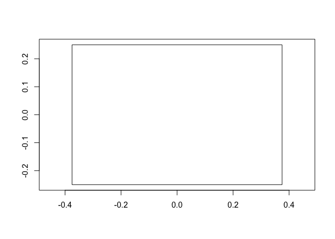
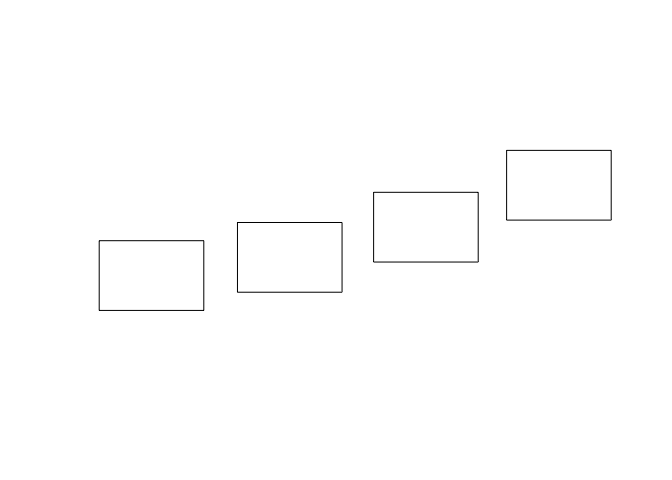
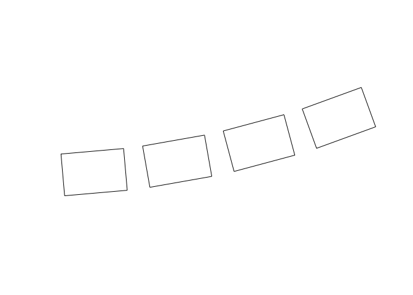
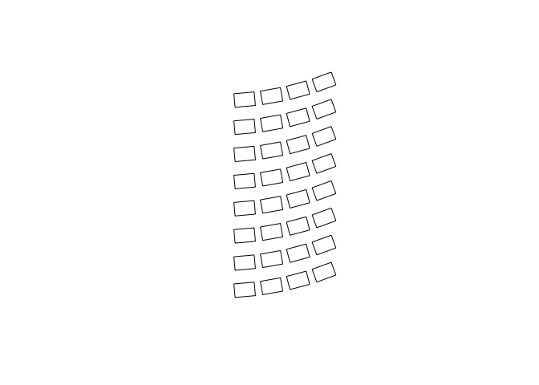
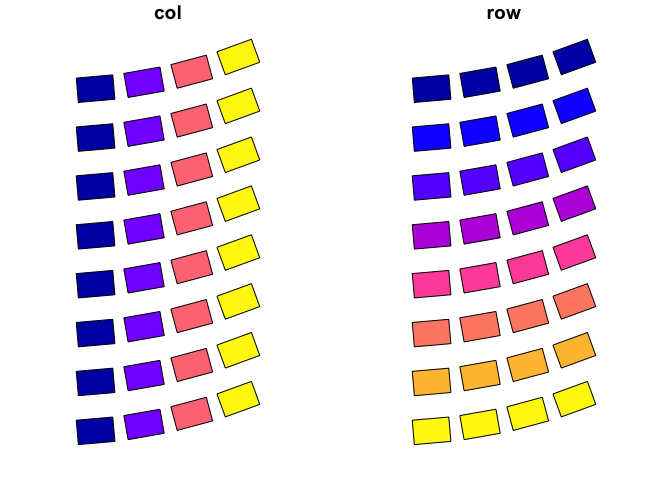
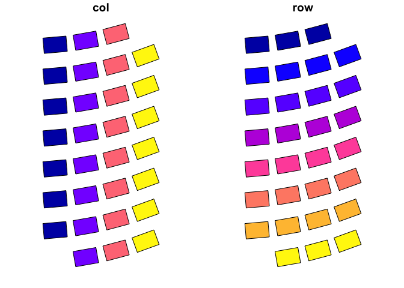
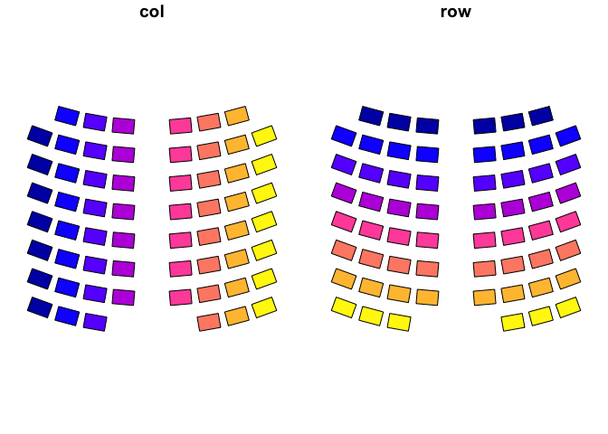
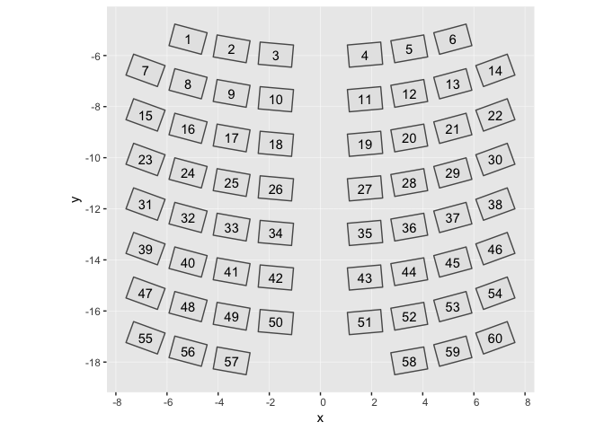

Oregon House Seat Layout
========================

The code in this README generates a GeoJSON file, [`seats.json`](/seats.json) of the approximate layout of desks in the Oregon State House of Representatives.

This is a little abusive of the format since obviously the coordinates of the desks are not geographical in nature. However, GeoJSON appears to be the easiest way to get abitrary polygons in vega-lite using the [geoshape](https://vega.github.io/vega-lite/docs/geoshape.html) mark.

The code makes heavy use of the [sf](http://r-spatial.github.io/sf/) package to represent polygons, and [purrr](https://purrr.tidyverse.org/) to manipulate lists.

Setup
-----

``` r
# devtools::install_github("ropensci/geojsonio")
library(tidyverse)
library(geojsonio)
library(sf)
library(here)
library(jsonlite)
```

Setting up parameters
---------------------

Relative seat dimensions:

``` r
width <- 0.75
height <- 0.5
```

Seat layout of one side:

``` r
cols <- 4
rows <- 8
```

Parameters affecting curvature:

``` r
radius <- 20
angle_range <- c(5, 20)
```

Constructing seat layout
------------------------

Make each seat a scaled square:

``` r
unit_square <- matrix(c(
    0, 0,
    0, 1, 
    1, 1, 
    1, 0,
    0, 0
  ), 
  ncol = 2, byrow = TRUE) - c(0.5, 0.5)

one_seat <- unit_square %*%
  matrix(c(width, 0, 0, height), ncol = 2, byrow = T)

seat_poly <- st_polygon(list(one_seat))
plot(seat_poly, axes = TRUE)
```



Put seat centers of one row along a circle:

``` r
theta <- -pi * seq(angle_range[1], angle_range[2], 
  length.out = cols)/180

# distance between centers
chord <- abs(radius*2*sin(diff(theta)[1]/2))

# coordinates of centers
x <- radius * sin(theta)
y <- radius * cos(theta)

# a list of points, one for each seat each center
centers <- st_sfc(map2(-x, -y, ~ st_point(c(.x, .y))))

# a list of seats, one for each seat each center
seats <- st_sfc(rep(list(seat_poly), length(centers)))

# translate and scale seats to make a row
one_row <- seats * chord + centers 

plot(one_row)
```



Then rotate to face inward:

``` r
rotate <- function(a) {
  matrix(c(cos(a), sin(a), -sin(a), cos(a)), 2, 2)
}

rotated_seats <- pmap(list(one_row, theta, centers),
  function(rect, angle, center){
    (rect - center)*rotate(angle) + center
  }
) %>% st_sfc()

plot(rotated_seats) 
```



Now make RHS by repeating once for each row

``` r
rhs_seats <-  map(1:rows, ~ rotated_seats + c(0, .)*chord) %>% 
   purrr::flatten() %>% 
   st_sfc()

plot(rhs_seats)
```



Put in `sf` to keep track of rows and columns

``` r
rhs <- st_sf(
  col = rep(cols + seq_len(cols), rows),
  row = rep(seq_len(rows), each = cols) %>% rev(),
  geometry = rhs_seats)
plot(rhs)
```



Exclude any seats that aren't part of the layout

``` r
rhs <- rhs[c(-1, -32), ]
plot(rhs)
```



Then mirror for LHS

``` r
mirror_y <- matrix(c(-1, 0, 0, 1), nrow = 2, byrow = TRUE)
lhs <- rhs %>% 
  mutate(
    geometry = geometry * mirror_y,
    col = 2*cols - col + 1
  )
```

    ## Warning: The `printer` argument is soft-deprecated as of rlang 0.3.0.
    ## This warning is displayed once per session.

This mirroring means points are specified counter-clockwise which vega-lite doesn't like, so need to reverse the order of coordinates:

``` r
reverse_winding <- function(poly){
  coords <- st_coordinates(poly)
  rev_rows <- rev(seq_len(nrow(coords)))
  st_polygon(list(coords[rev_rows, c("X", "Y")]))
}

lhs <- lhs %>% 
  mutate(geometry = map(geometry, reverse_winding))
```

Then put togther

``` r
seats <- rbind(lhs, rhs)
plot(seats)
```



Add metadata for seats
----------------------

``` r
centroids <- seats$geometry %>% 
  st_centroid() %>% 
  st_coordinates()
```

``` r
# coordinates of center
seats <- seats %>% 
  mutate(
    x = centroids[, 1],
    y = centroids[, 2])

# desk number
seats <- seats %>% 
  arrange(row, col) %>% 
  mutate(seat = 1:n()) 
```

The final layout
----------------

``` r
seats %>% 
  ggplot() +
    geom_sf() +
    geom_text(aes(x = x, y = y, label = seat))
```



Save for later
--------------

``` r
seats %>% 
geojson_list(seats) %>% 
  geojson_write(file = here("seats.json"),
    pretty = TRUE)
```

Session Info
------------

``` r
sessionInfo()
```

    ## R version 3.5.0 (2018-04-23)
    ## Platform: x86_64-apple-darwin15.6.0 (64-bit)
    ## Running under: macOS Sierra 10.12.6
    ## 
    ## Matrix products: default
    ## BLAS: /Library/Frameworks/R.framework/Versions/3.5/Resources/lib/libRblas.0.dylib
    ## LAPACK: /Library/Frameworks/R.framework/Versions/3.5/Resources/lib/libRlapack.dylib
    ## 
    ## locale:
    ## [1] en_US.UTF-8/en_US.UTF-8/en_US.UTF-8/C/en_US.UTF-8/en_US.UTF-8
    ## 
    ## attached base packages:
    ## [1] stats     graphics  grDevices utils     datasets  methods   base     
    ## 
    ## other attached packages:
    ##  [1] bindrcpp_0.2.2       jsonlite_1.6         here_0.1            
    ##  [4] sf_0.6-3             geojsonio_0.6.0.9100 forcats_0.3.0       
    ##  [7] stringr_1.3.1        dplyr_0.7.8          purrr_0.2.5         
    ## [10] readr_1.1.1          tidyr_0.8.1          tibble_1.4.2        
    ## [13] ggplot2_3.1.0        tidyverse_1.2.1     
    ## 
    ## loaded via a namespace (and not attached):
    ##  [1] Rcpp_1.0.0       lubridate_1.7.4  lattice_0.20-35  class_7.3-14    
    ##  [5] assertthat_0.2.0 rprojroot_1.3-2  digest_0.6.18    psych_1.8.4     
    ##  [9] V8_1.5           R6_2.3.0         cellranger_1.1.0 plyr_1.8.4      
    ## [13] backports_1.1.2  evaluate_0.10.1  e1071_1.7-0      httr_1.4.0      
    ## [17] geojson_0.2.0    pillar_1.2.3     rlang_0.3.0.9001 lazyeval_0.2.1  
    ## [21] curl_3.2         readxl_1.1.0     rstudioapi_0.8   rmarkdown_1.10  
    ## [25] rgdal_1.3-4      jqr_1.0.0        foreign_0.8-70   munsell_0.5.0   
    ## [29] broom_0.4.4      compiler_3.5.0   modelr_0.1.2     pkgconfig_2.0.2 
    ## [33] mnormt_1.5-5     rgeos_0.3-28     htmltools_0.3.6  tidyselect_0.2.5
    ## [37] crayon_1.3.4     withr_2.1.2      grid_3.5.0       nlme_3.1-137    
    ## [41] spData_0.2.8.3   gtable_0.2.0     DBI_1.0.0        magrittr_1.5    
    ## [45] units_0.6-0      scales_1.0.0     cli_1.0.0        stringi_1.2.2   
    ## [49] reshape2_1.4.3   sp_1.3-1         xml2_1.2.0       tools_3.5.0     
    ## [53] glue_1.3.0       hms_0.4.2        parallel_3.5.0   yaml_2.2.0      
    ## [57] colorspace_1.3-2 maptools_0.9-4   classInt_0.2-3   rvest_0.3.2     
    ## [61] knitr_1.20       bindr_0.1.1      haven_1.1.1
